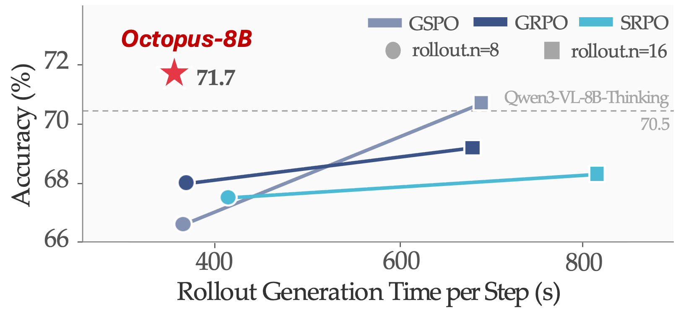
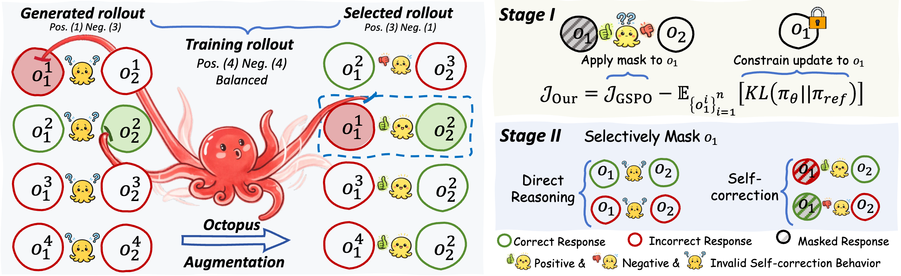

# Octopus: Learning Self-Correction in Vision-Language Models via Rollout Augmentation

##### If you find our project helpful, please consider giving us a star :star: on GitHub!

<h5 align="center">

[](https://arxiv.org/pdf/2602.08503) [](https://dripnowhy.github.io/Octopus/) [](https://huggingface.co/collections/Tuwhy/octopus) [](https://github.com/DripNowhy/Octopus)
<!-- [](https://huggingface.co/collections/Tuwhy/sherlock-6835f46e450a48f228f7e80d)  -->


</h5>

## :loudspeaker: News

- **[2026/02/09]** We've released the paper, model checkpoints of Octopus.

## :fire: Overview

<p align="center">
  
  Octopus-8B achieves SoTA performance using the least rollout generation time per step.
</p>

<p align="center">
  
  Where signals are sparse, we sythesize!
</p>

 <details>
<summary><b>Abstract</b></summary>

Self-correction is essential for solving complex reasoning problems in vision–language models (VLMs). However, existing reinforcement learning (RL) methods struggle to learn it, as effective self-correction behaviors emerge only rarely, making learning signals extremely sparse. To address this challenge, we propose c**o**rre**ct**i**o**n-s**p**ecific rollo**u**t**s** (**Octopus**), an RL rollout augmentation framework that synthesizes dense self-correction examples by recombining existing rollouts. This augmentation simultaneously improves sample efficiency due to rollout reuse and stabilizes RL optimization through balanced supervision. Furthermore, we introduce a response-masking strategy that decouples self-correction from direct reasoning, avoiding signal conflicts and enabling both behaviors to be learned effectively. Building on this, we introduce $\texttt{Octopus-8B}$, a reasoning VLM with controllable self-correction capability. Across 7 benchmarks, it achieves SoTA performance among open-source VLMs, outperforming the best RLVR baseline by 1.0 score while requiring only $0.72\times$ training time per step.

</details>

## :wrench: Usage

### Demo
Below, we provide simple examples to show how to use $\texttt{Octopus-8B}$ with vLLM and 🤗 Transformers.
```bash
# transformers inference
python inference_hf.py

# vllm inference
python inference_vllm.py
```

<details>
<summary><b>Example Case</b></summary>

If you want a quick use of Octopus-8B, here is the reference code. Make sure appendix prompt_suffix to the end of the prompt to trigger self-correction:

<p align="center">
  
</p>

```python
from transformers import Qwen3VLForConditionalGeneration, AutoProcessor

prompt_suffix = """\n\nYou first think through your reasoning process as an internal monologue, enclosed within <think> </think> tags. Then, provide your final answer enclosed within \\boxed{}. If you believe the answer can be further enhanced, generate <self-correction> </self-correction> tags enclosed with no content, and regenerate a new reasoning process and a new answer from scratch after that. The new response should first think through your reasoning process as an internal monologue, enclosed within <think> </think> tags. Then, provide your final answer enclosed within \\boxed{}. All reasoning, answer steps must be included without omission."""

# default: Load the model on the available device(s)
model = Qwen3VLForConditionalGeneration.from_pretrained(
    "Tuwhy/Octopus-8B", dtype="auto", device_map="auto"
)

# We recommend enabling flash_attention_2 for better acceleration and memory saving, especially in multi-image and video scenarios.
# model = Qwen3VLForConditionalGeneration.from_pretrained(
#     "Qwen/Qwen3-VL-8B-Instruct",
#     dtype=torch.bfloat16,
#     attn_implementation="flash_attention_2",
#     device_map="auto",
# )

processor = AutoProcessor.from_pretrained("Tuwhy/Octopus-8B")

messages = [
    {
        "role": "user",
        "content": [
            {
                "type": "image",
                "image": "./assets/head.png",
            },
            {"type": "text", "text": "The accuracy gap between the Octopus-8B and the Qwen3-8B-VL-Thinking model is?" + prompt_suffix},
        ],
    }
]

# Preparation for inference
inputs = processor.apply_chat_template(
    messages,
    tokenize=True,
    add_generation_prompt=True,
    return_dict=True,
    return_tensors="pt"
)
inputs = inputs.to(model.device)

# Inference: Generation of the output
generated_ids = model.generate(**inputs, max_new_tokens=8192*2)
generated_ids_trimmed = [
    out_ids[len(in_ids) :] for in_ids, out_ids in zip(inputs.input_ids, generated_ids)
]
output_text = processor.batch_decode(
    generated_ids_trimmed, skip_special_tokens=True, clean_up_tokenization_spaces=False
)
print(output_text)

```

```txt
    <think>
    I need to identify the lowest numbered yard line visible in the image. Looking at the field, I can see the yard lines marked with numbers. Starting from the bottom of the image, I can clearly see the number ``30" on the field. Moving up, I can see ``40", ``50", and ``60" as well. The ``1" is visible as part of the ``1" on the 1-yard line, which is near the goal line. The ``1" is at the very end of the field, so it should be the lowest numbered yard line. Therefore, the lowest number yard line I can see is 1.
    </think>

    \boxed{1}

    <self-correction>
    </self-correction>

    <think>
    To determine the lowest numbered yard line visible, I need to examine the yard line markings on the field. The yard lines are clearly labeled with numbers, and I can see several of them.
    Starting from the bottom of the image (closest to the viewer), the visible numbers are: - 30 - 40 - 50 - 60
    These are the primary yard lines marked on the field. The ``1" is not visible in the image; it's located near the goal line, which is beyond the 0-yard line.

    However, the question asks for the lowest number yard line that can be seen. The lowest number among the visible markings is 30.

    </think>

    \boxed{30}
```

</details>

### Training

1. **Preparation of the Environment:**
    ```bash
    git clone https://github.com/DripNowhy/Octopus.git
    cd Octopus

    conda create -n octopus python=3.10 -y
    conda activate octopus
    pip install uv
    cd EasyR1
    pip install -e .
    uv pip install vllm
    ```

2. **Preparation of the SFT data:**
    ```bash
    cd ../SFT
    bash download.sh
    # after fill the specific path, you can construct the sft dataset.
    bash construct.sh
    ```

3. **SFT cold-start:**
    We provide the training scripts in LLaMA-Factory in [qwen3vl_full_sft.yaml](https://github.com/DripNowhy/Octopus/SFT/qwen3vl_full_sft.yaml).

4. **RL training:**
    You need first replace model path in the scripts, then you can use the provided scripts to train model.
    ```bash
    cd ../EasyR1

    # stage 1 training
    bash examples/qwen3_vl_8b_virl_scpo_st1.sh

    # stage 2 training
    bash examples/qwen3_vl_8b_virl_scpo_st2.sh
    ```

<!-- TODO: Add usage instructions -->

## 🦾 Acknowledgement

Our project benefits from [LLaVA-CoT](https://github.com/PKU-YuanGroup/LLaVA-CoT), [VL-rethinker](https://github.com/TIGER-AI-Lab/VL-Rethinker), [EasyR1](https://github.com/hiyouga/EasyR1), and [VLMEvalKit](https://github.com/open-compass/VLMEvalKit). Thanks for their wonderful works.

## :page_facing_up: Citation

If you find our project helpful, please cite our series papers as:
```bibtex
@article{ding2025sherlock,
  title={Sherlock: Self-Correcting Reasoning in Vision-Language Models},
  author={Ding, Yi and Zhang, Ruqi},
  journal={arXiv preprint arXiv:2505.22651},
  year={2025}
}

@article{ding2026octopus,
  title={Learning Self-Correction in Vision-Language Models via Rollout Augmentation},
  author={Ding, Yi and Li, Bolian and Zhang, Ruqi},
  journal={arXiv preprint arXiv:xxxx.xxxxx},
  year={2026}
}
```
